<!-- ================== HEADER ================== -->
<h1 align="center">Stock Trek</h1>
<h3 align="center"><em>Search stocks, watch <strong>near real-time</strong> quotes, and paper-trade with virtual cash</em></h3>

<!-- Tech Stack with Devicons + labels -->
<table align="center">
  <tr>
    <td align="center" width="65">
      <br>
      <sub><b>React</b></sub>
    </td>
    <td align="center" width="65">
      <br>
      <sub><b>JavaScript</b></sub>
    </td>
    <td align="center" width="65">
      <br>
      <sub><b>Node.js</b></sub>
    </td>
    <td align="center" width="65">
      <br>
      <sub><b>MongoDB</b></sub>
    </td>
    <td align="center" width="65">
      <br>
      <sub><b>App Engine</b></sub>
    </td>
  </tr>
</table>

<p align="center">
  
  
  
  
  <!-- Last-commit badge needs the GitHub owner/repo. -->
  
</p>


<h2 id="live-demo">🎬 Project Demo</h2>

<table align="center">
  <tr>
    <td align="center"><b>📱 Mobile</b></td>
    <td width="40"></td>
    <td align="center"><b>🖥️ Desktop</b></td>
  </tr>
  <tr>
    <td align="center">
      <video src="https://github.com/user-attachments/assets/d0581c44-fa19-4f21-997d-282d4e2a7568" controls width="230" height="500"></video>
    </td>
    <td width="40"></td>
    <td align="center">
      <video src="https://github.com/user-attachments/assets/4725e287-37eb-492b-9ef5-2779a849d8a8" controls width="480" height="270"></video>
    </td>
  </tr>
</table>
<p align="center">▶️ Video not loading or want higher resolution? <a href="https://www.youtube.com/playlist?list=PLlwKy83RT93w2cDQKZll6XNfDIVffzG_3">Watch it on YouTube</a>.</p>


## 📖 Table of Contents
1. [About the Project](#about-the-project)  
2. [Tech Stack](#tech-stack)  
3. [Features](#features)  
4. [Architecture](#architecture)  
5. [Getting Started](#getting-started)  
6. [Project Structure](#project-structure)  
7. [Screenshots](#screenshots)  
8. [Usage](#usage)  
9. [Challenges & Learnings](#challenges-learnings)  
10. [Future Enhancements](#future-enhancements)  
11. [Contributing](#contributing)  
12. [License](#license)  
13. [Contact](#contact)


<h2 id="about-the-project">1. 🌟 About the Project</h2>

Stock Trek is a stock research and paper-trading web app. You can search any ticker, read its company profile and latest news, study interactive price charts, save names to a watchlist, and place buy and sell orders using virtual cash so you can practice building a portfolio without real money at risk. Quotes refresh on a short interval, so a symbol you are watching updates while you read.

> Search a ticker, read its charts and news, save it to a watchlist, then trade it with virtual cash.

The project is split into two fully independent apps in one repository: a React front end and an Express back end that proxies live market data. The server keeps the API keys and database access on its side and exposes a small set of endpoints, while the client focuses on presentation and polling for fresh prices. When the market is closed, the server can simulate gentle price movement so the live-quote experience still works during development.


<h2 id="tech-stack">2. 🛠 Tech Stack</h2>

<p>
  <!-- Frontend -->
  
  
  
  
  
  
  <br>
  <!-- Backend -->
  
  
  
  <br>
  <!-- Infra & external data -->
  
  
  
  <br>
  <!-- Testing -->
  
  
</p>


| Layer                  | Technologies                                                                                                                       |
| ---------------------- | --------------------------------------------------------------------------------------------------------------------------------- |
| **Frontend / UI**      | React 18, React Router 6, React-Bootstrap 2, Highcharts 11 (stock, indicators, drag-panes), react-icons, FontAwesome, react-device-detect, Luxon |
| **Backend**            | Node.js 20, Express 4, CORS, Multer, node-fetch, Jade (scaffold) |
| **Data**               | MongoDB (Atlas), database `stockNew` with `watchlist`, `wallet`, and `portfolio` collections |
| **Infra**              | Google App Engine (separate `app.yaml` per app) |
| **External data APIs** | Finnhub (quotes, company, news, peers, insiders, EPS, recommendations), Polygon.io (chart aggregates) |
| **Testing**            | Jest with React Testing Library (Create React App) |


> **Why this stack:** React with React-Bootstrap and Highcharts covers a data-dense, responsive UI with rich financial charts, while a thin Express server keeps market-data keys and MongoDB access off the client and normalizes the Finnhub and Polygon responses the front end needs.


<h2 id="features">3. ✨ Features</h2>

- ✅ **Ticker search with autocomplete:** search any symbol and get suggestions backed by the Finnhub autocomplete endpoint.
- ✅ **Company summary:** profile, current quote, and key figures for the selected stock on the Summary tab.
- ✅ **Near real-time quotes:** the client polls the `/quote` endpoint every 15 seconds so prices update while you view a symbol.
- ✅ **Interactive charts:** intraday and historical price charts rendered with Highcharts Stock, including indicators and draggable panes, fed by Polygon.io aggregates.
- ✅ **Top news:** the latest company-related headlines on the News tab.
- ✅ **Insights tab:** peers, insider transactions, historical EPS surprises, and analyst recommendation trends.
- ✅ **Watchlist:** save and remove symbols, persisted in the MongoDB `watchlist` collection.
- ✅ **Paper-trading portfolio:** buy and sell shares with virtual cash; the server updates the `portfolio` and `wallet` documents together, deducting or adding cash and averaging the cost basis.
- ✅ **Closed-market simulation:** when the market is closed, the server can fake gentle price movement so live quotes still animate during development.
- ✅ **Responsive UI:** React-Bootstrap layout plus `react-device-detect` adapt the interface across phone and desktop.


<h2 id="architecture">4. 🏗 Architecture</h2>

The repo holds two independent apps that are built, run, and deployed separately: a Create React App front end in `client/` and an Express back end in `server/`. A detail worth knowing: `server/app.js` is the express-generator skeleton and the process entry point via `bin/www`, but the real API lives in `server/routes/server.js`, which is itself a complete Express app mounted at `/server`. Every real endpoint therefore sits under `/server/...` (for example `/server/quote`, `/server/watchlist`).

1. The client calls the deployed server's `/server/...` endpoints for all data and trading actions.
2. The server proxies Finnhub and Polygon.io for market data and never exposes those keys to the browser.
3. Trading endpoints (`/purchase`, `/sell`) mutate the `portfolio` and `wallet` documents together to keep cash and holdings consistent.
4. When adding or changing API routes, edit `server/routes/server.js`, not `app.js`.

<!-- GitHub renders Mermaid natively. -->

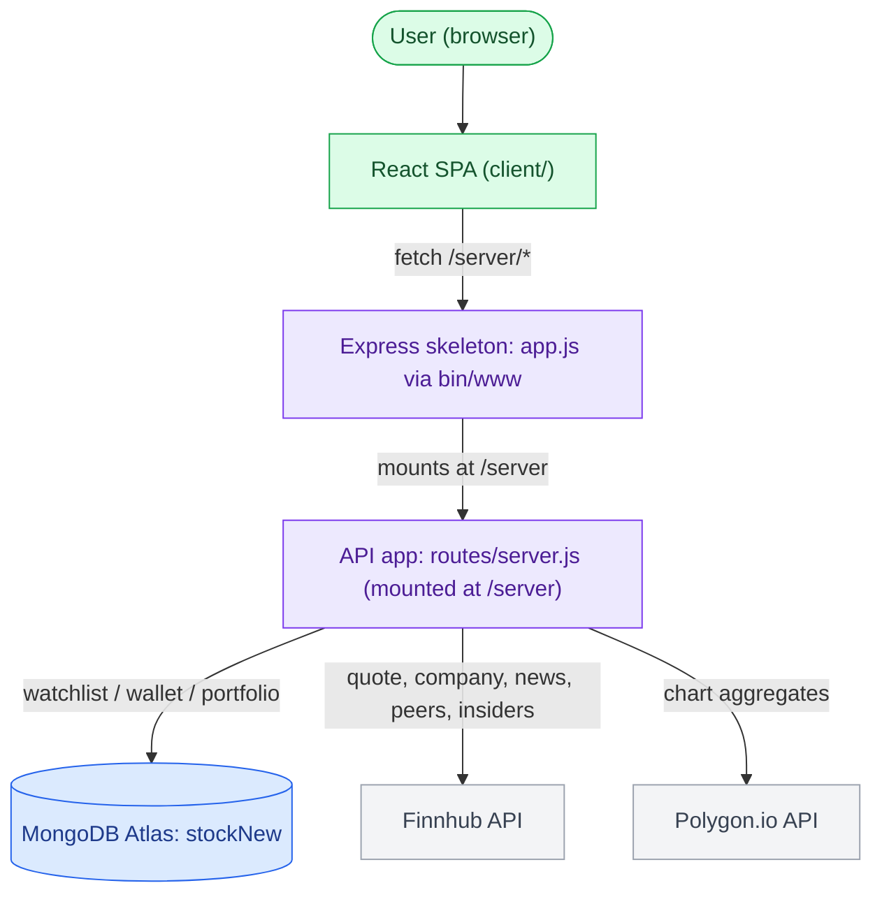

The client currently hardcodes the production App Engine base URL in every `fetch` call (there is no env var or CRA proxy), so pointing the front end at a local server means editing those URLs across `Search.jsx`, `Watchlist.jsx`, `Portfolio.jsx`, and `SearchBar.jsx`, or introducing a shared base-URL constant first.


<h2 id="getting-started">5. 🚀 Getting Started</h2>

### Prerequisites

```text
Node.js 20.x  (server engine; also fine for the client)
npm           (bundled with Node)
MongoDB Atlas cluster + connection string
Finnhub API key
Polygon.io API key
gcloud CLI    (only needed to deploy to Google App Engine)
```

> Note: the server currently has the Finnhub key, Polygon.io key, and MongoDB connection string committed directly in `server/routes/server.js`. Treat those as compromised and move them to environment variables before any real use.

### Installation

```bash
git clone https://github.com/mohansaiganesh/stock_trek.git
cd stock_trek

# Front end
cd client && npm install

# Back end (in a second terminal)
cd server && npm install
```

### Run the App

```bash
# Terminal 1 - back end (listens on port 5000, override with PORT)
cd server && npm start

# Terminal 2 - front end (dev server on http://localhost:3000)
cd client && npm start
```

### Scripts

| command               | what it does                                                   |
| --------------------- | ------------------------------------------------------------- |
| `client: npm start`   | Runs the React dev server on http://localhost:3000            |
| `client: npm run build` | Production build into `client/build/`                       |
| `client: npm test`    | Jest in watch mode (react-scripts)                            |
| `server: npm start`   | Runs `./bin/www`, listening on port 5000                      |
| `server: npm run deploy` | Deploys the server to Google App Engine (`gcloud app deploy`) |


<h2 id="project-structure">6. 📂 Project Structure</h2>


```text
stock_trek/
┣ 📂 client/                 # React (Create React App) front end
┃ ┣ 📂 public/
┃ ┣ 📂 src/
┃ ┃ ┣ 📂 components/         # UI + data-fetching components
┃ ┃ ┃ ┣ 📜 Search.jsx        # Orchestrator: fetches a ticker's data, renders tabs
┃ ┃ ┃ ┣ 📜 Summary.jsx       # Company profile + quote tab
┃ ┃ ┃ ┣ 📜 Charts.jsx        # Highcharts price charts
┃ ┃ ┃ ┣ 📜 TopNews.jsx       # Latest company headlines
┃ ┃ ┃ ┣ 📜 Insights.jsx      # Peers, insiders, EPS, recommendations
┃ ┃ ┃ ┣ 📜 SearchBar.jsx     # Ticker search + autocomplete
┃ ┃ ┃ ┣ 📜 SearchHome.jsx    # Landing view
┃ ┃ ┃ ┣ 📜 Watchlist.jsx     # Saved symbols
┃ ┃ ┃ ┗ 📜 Portfolio.jsx     # Paper-trading portfolio
┃ ┃ ┣ 📜 App.js              # React Router routes
┃ ┃ ┗ 📜 App.test.js
┃ ┣ 📜 app.yaml              # App Engine config (serves build/ as static)
┃ ┗ 📜 package.json
┗ 📂 server/                 # Express + MongoDB back end
  ┣ 📂 bin/
  ┃ ┗ 📜 www                 # Process entry point (port 5000)
  ┣ 📂 routes/
  ┃ ┣ 📜 server.js           # The real API app, mounted at /server
  ┃ ┣ 📜 index.js            # Scaffold (unused)
  ┃ ┗ 📜 users.js            # Scaffold (unused)
  ┣ 📂 views/                # Jade scaffold (unused)
  ┣ 📜 app.js                # express-generator skeleton, mounts /server
  ┣ 📜 app.yaml              # App Engine config
  ┗ 📜 package.json
```


<h2 id="screenshots">7. 🖼 Screenshots</h2>

<h3 align="center">🖥️ Desktop</h3>

<table align="center">
  <tr>
    <td align="center"><b>Homepage</b></td>
    <td width="40"></td>
    <td align="center"><b>Watchlist</b></td>
    <td width="40"></td>
    <td align="center"><b>Portfolio</b></td>
  </tr>
  <tr>
    <td align="center">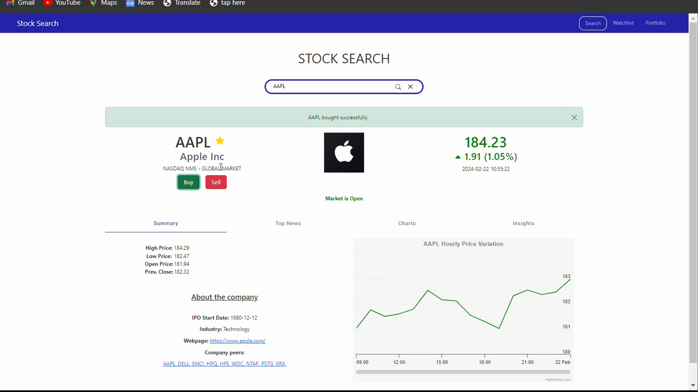</td>
    <td width="40"></td>
    <td align="center">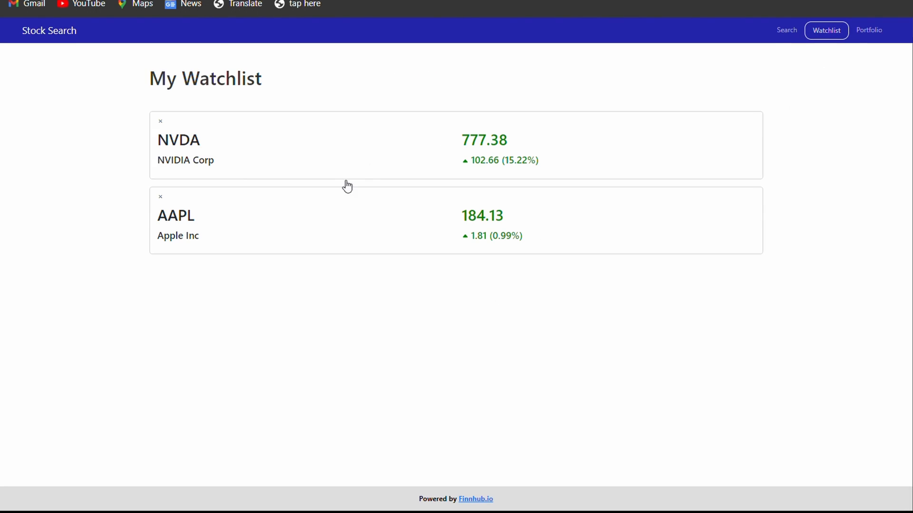</td>
    <td width="40"></td>
    <td align="center">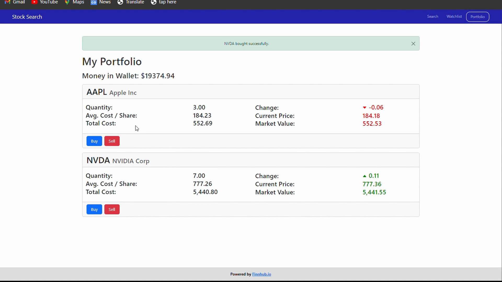</td>
  </tr>
  <tr>
    <td align="center"><b>Charts</b></td>
    <td width="40"></td>
    <td align="center"><b>Insights</b></td>
    <td width="40"></td>
    <td align="center"><b>Buy/Sell Modal</b></td>
  </tr>
  <tr>
    <td align="center">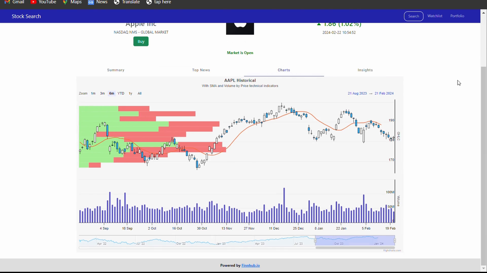</td>
    <td width="40"></td>
    <td align="center">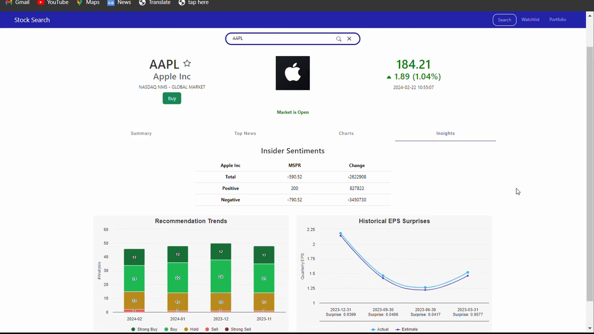</td>
    <td width="40"></td>
    <td align="center">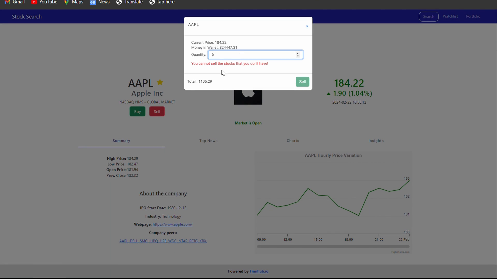</td>
  </tr>
</table>

<h3 align="center">📱 Mobile</h3>

<table align="center">
  <tr>
    <td align="center"><b>Mobile Homepage</b></td>
    <td width="40"></td>
    <td align="center"><b>Mobile Watchlist</b></td>
    <td width="40"></td>
    <td align="center"><b>Mobile Portfolio</b></td>
  </tr>
  <tr>
    <td align="center">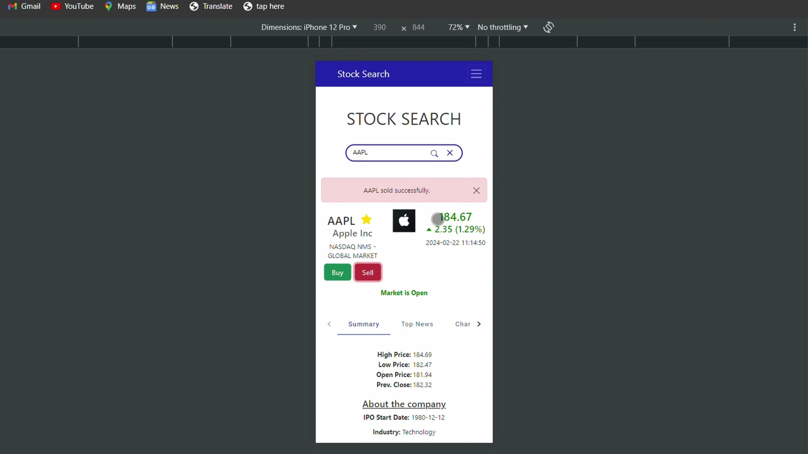</td>
    <td width="40"></td>
    <td align="center">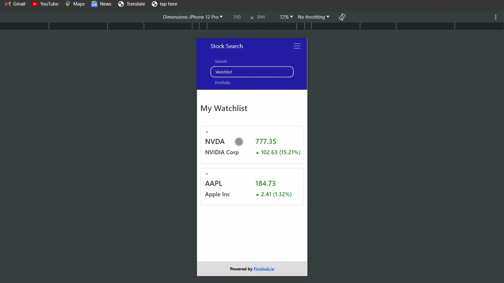</td>
    <td width="40"></td>
    <td align="center">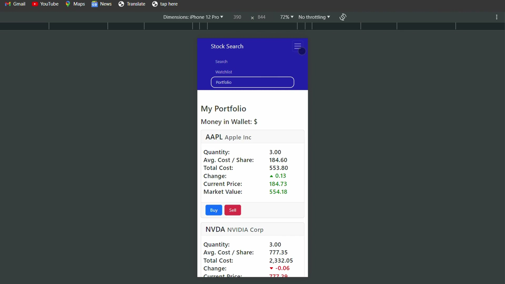</td>
  </tr>
  <tr>
    <td align="center"><b>Mobile Charts</b></td>
    <td width="40"></td>
    <td align="center"><b>Mobile Insights</b></td>
    <td width="40"></td>
    <td align="center"><b>Mobile Buy/Sell Modal</b></td>
  </tr>
  <tr>
    <td align="center">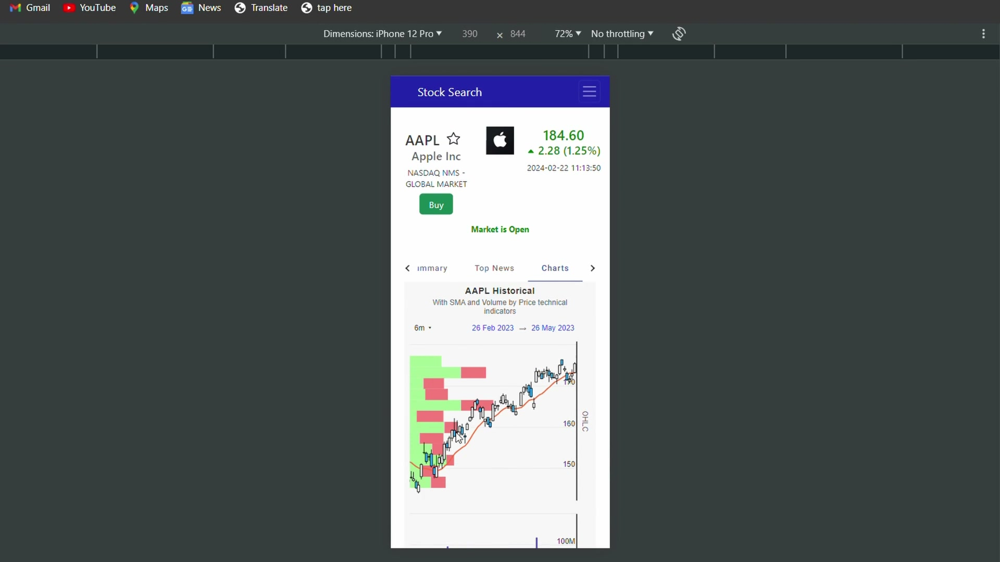</td>
    <td width="40"></td>
    <td align="center">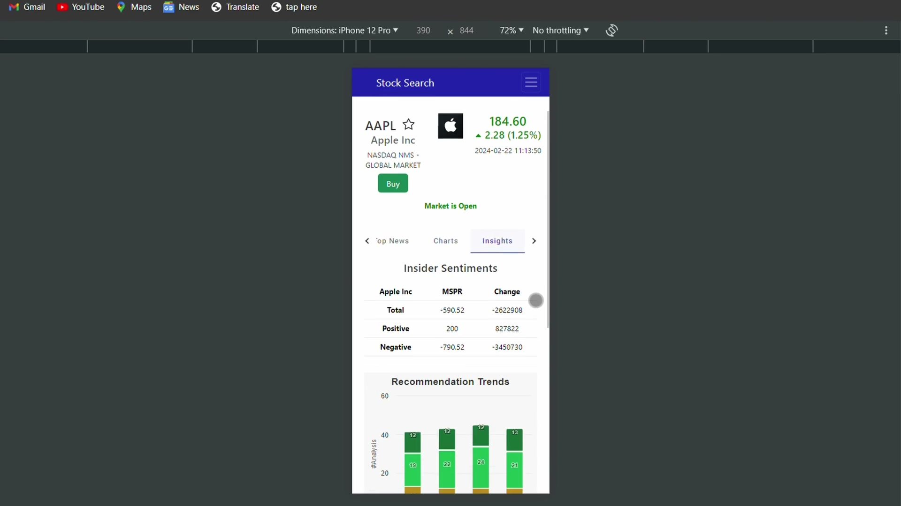</td>
    <td width="40"></td>
    <td align="center">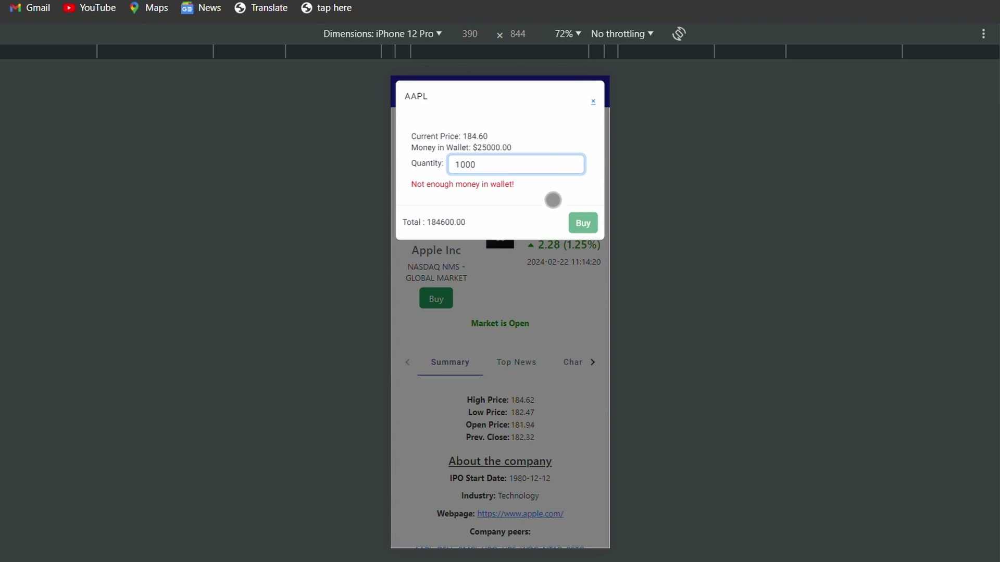</td>
  </tr>
</table>


<h2 id="usage">8. ⚡ Usage</h2>

1. Open the app; the root route redirects to the search home at `/search/home`.
2. Type a ticker in the search bar and pick a suggestion from the autocomplete list.
3. Read the company on the **Summary** tab and watch the quote refresh every 15 seconds.
4. Switch tabs to see **Charts**, **Top News**, and **Insights** (peers, insiders, EPS, recommendations).
5. Add the symbol to your **Watchlist** to track it, or open it later from the watchlist view.
6. Go to **Portfolio** to buy or sell shares with virtual cash and watch your cash balance and holdings update.


<h2 id="challenges-learnings">9. 🧠 Challenges & Learnings</h2>

| Challenge | Solution &amp; takeaway |
| --- | --- |
| **Keeping the live-quote feel when the market is closed** | Added a `simulateMarket` flag and a `simulateMarketData()` helper on the server that fakes gentle price movement for `/quote`, so the polling UI still animates during off-hours. |
| **Two independent apps in one repo** | Gave `client/` and `server/` their own `package.json` and `app.yaml` so they build, run, and deploy separately, and documented the split so the boundary stays clean. |
| **Routing skeleton vs. real API** | The express-generator `app.js` is only the entry point; the actual API is a second Express app in `routes/server.js` mounted at `/server`. Learned to always add routes there, not in the skeleton. |
| **Consistent trades** | Buy and sell endpoints update the `portfolio` and `wallet` documents together so cash, holdings, and averaged cost basis never drift out of sync. |


<h2 id="future-enhancements">10. 🚧 Future Enhancements</h2>

- 🔑 Move the committed Finnhub, Polygon.io, and MongoDB Atlas credentials out of `server/routes/server.js` and into environment variables.
- 🔗 Replace the hardcoded production server URL in the client with a single configurable base URL or env var so local development does not require editing every `fetch`.
- 🧹 Remove the unused express-generator scaffolding (`routes/index.js`, `routes/users.js`, and the Jade views).
- 🧪 Add server-side tests and a lint setup (none are configured today).


<h2 id="contributing">11. 🤝 Contributing</h2>

This is a personal portfolio project and isn't currently accepting external contributions, but feedback and questions are welcome (see [Contact](#contact)).


<h2 id="license">12. 📝 License</h2>

Personal **portfolio project**, shared to demonstrate engineering work and **not licensed for reuse**.
No license is granted, so please don't redistribute or use the source without permission.


<h2 id="contact">13. 📬 Contact</h2>

<p align="left">
  &nbsp;&nbsp;
  <a href="https://www.linkedin.com/in/mohansaiganeshkanna/">
    
  </a>
  <a href="https://kmohansaiganesh.github.io/Portfolio">
    
  </a>
  <a href="mailto:mohansaiganeshk@gmail.com">
    
  </a>
</p>
